## Introduction/Background

**<font color='#E6479B'><center><big>45 HOURS/YEAR</big></center></font>**

That’s how much time an average American consumer spends on choosing what to watch next! With the amount of data we have today, we can be smarter and understand our options better. Every movie you watch has an official record that lets us know its rating, language, genre, cast, and a multitude of other details. Using this information, we aim to build a solution to make people's lives easier!

## Problem Definition

We formally divide our problem into two functional objectives, with the first one being -

**“Recommend a set of similar movies to a user based on the movies they’ve watched before, or based on a particular movie they’ve searched.”**
 
 
The method above is called content-based filtering - suggesting recommendations based on the item metadata. The main idea is if a user likes an item, then the user will also like items similar to it.
 
The other functional objective is -
 
**“Suggest the top N movies to a user, based on other users with similar movie preferences.”**
 
The method above is called collaborative filtering - these systems make recommendations by grouping users with similar interests.

<!-- 
## Dataset

The [MovieLens](https://movielens.org/)[1] dataset created by [GroupLens Research](https://grouplens.org/) (Department of CSE @UniversityOfMinnesota) contains a multitude of data pertaining to movies. It offers a variety of specifications, sizes, and features. The dataset we have decided on is called [“MovieLens 25M.”](https://grouplens.org/datasets/movielens/25m/) Released in December of 2019, it has a total of **25M ratings**.  **1M tags** are applied to **62K Movies** by almost **162K users**. -->

## Methods

Generally, Machine Learning projects evolve through a cycle of Data Cleaning, Preparation, Feature Generation & Selection, Modelling, Optimization & Deployment. As the process has become dynamic over time, a lot of these processes get supplemented with additional processes and tend to get iterative as well. For our project, we will use a few basic blocks or segments - 

### Data Collection

For one of the most critical steps in the pipeline, we used the [MovieLens](https://movielens.org/)[1] dataset created by [GroupLens Research](https://grouplens.org/) (Department of CSE @UniversityOfMinnesota) which contains a multitude of data pertaining to movies. We decided to move ahead with the [“MovieLens 25M.”](https://grouplens.org/datasets/movielens/25m/) owing to the variety of data and features. Released in December of 2019, it has a total of **25M ratings**.  **1M tags** are applied to **62K Movies** by almost **162K users**.

For our functional objective, it was essential that we needed the data above, and some additional data that could help us get insights beyond the usual. Hence, we decided to scrape some data linked to the movies that were already in the [“MovieLens 25M.”](https://grouplens.org/datasets/movielens/25m/) Dataset. We used the ```links.csv``` file to get ```tmdb_id```s and scraped the data from the [TMDB API](https://www.themoviedb.org/documentation/api), which was added to the collection of data we already had.

### Data Cleaning & Preparation

Data Cleaning is an essential part of any data driven project. Working with large datasets means various types of data types like strings, booleans, numbers, currencies, date-time objects, etc., and it is important we pay close attention to how data is structured or populated. Sometimes, data is found to be duplicated, corrupted, present in different or invalid data types, structurally wrong, out of scale or even erroneous.

Above issues were dealt with by using following steps - 
* Duplicate data was checked for using unique or primary features like ```id``` and ```titles```, and if a duplicate row was found, it was dropped. 
* Later, each column was checked for missing data, and was handled as deemed appropriate for each feature. For reference, we used a roadmap offered by Alvira Swalin on this [Medium Blog](https://towardsdatascience.com/how-to-handle-missing-data-8646b18db0d4)
* Similarly, we handled structural flaws or data errors by either correcting the data values & data types, or simply treating it as a missing datapoint.  

Next, for preparation, it was important that we send our final data with adequately selected and standardized features, so that other learning tasks in the pipeline can be carried out with minimal or no issues. We followed the steps below - 
* One of the ways to go about that is to normalize, scale or standardize the features, especially  numerical.
* Once the features are standardized, we used **Principal Component Analysis** to identify the most relevant features.

Then, we packed all the updated data into a ```.csv``` file and pushed it further into the pipeline.

### Data Exploration & Visualization

To understand and comprehend the data on a higher level is essential before process the data further and develop machine learning models. We explored the data and visualized a few things that were interesting.

<!-- <div class="row">
  <div class="column">
    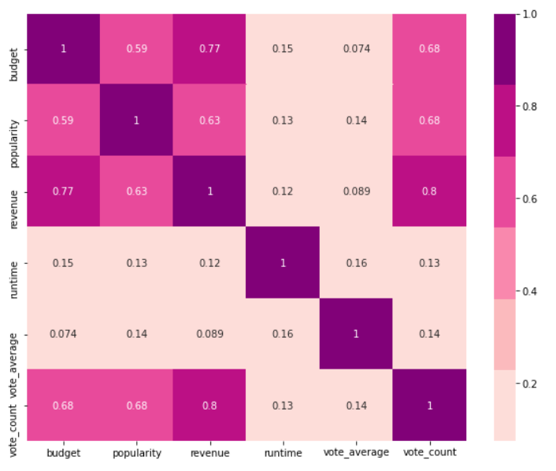
  </div>
  <div class="column">
    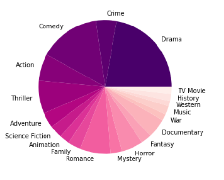
  </div>
</div>
 -->
 
<p align="center">
 
 
</p>
<!-- 
 
 -->
 
Here, in the first figure, we see a Correlation Matrix between the numerical variables of the ```tmdb_data``` dataset that offer information about the movies like ```budget```,```popularity```,```revenue```,```runtime```,```vote_average``` & ```vote_count```. We observe that ```revenue``` and ```vote_count``` are highly correlated, but ```revenue``` and ```vote_average``` show weak correlation, which helps us understand that a big revenue movie may be reviewed by a lot of users, but it may not necessarily translate into a higher average rating. Similarly, ```revenue``` and ```budget``` also exhibit strong correlation.

We also have a Pie Chart that breaks down the genres associated with all the movies, and the results follow the norm. 
 
### Files and Data

After the above steps, we have the following files that will help us solve our problems defined in the **Problem Definition** section -
* ```movies.csv```
* ```ratings.csv```
* ```tags.csv```
* ```genome-tags.csv```
* ```genome-scores.csv```
* ```credits-metadata.csv```
* ```tmdb_data.csv```

### Learning Methods

We intend to implement the following **Supervised Learning** Methods in our project -
* Decision Trees
* Linear Regression
* SVMs
* Gradient boosted trees
* Neural Networks

In addition, we will also try to implement **Unsupervised Learning** Methods such as -
* K-means Clustering 
* Association Rules  using  Apriori
* GMM
* Content-based filtering 
    * TF - IDF matrix
    * Cosine similarity
* Collaborative filtering 
    * Matrix factorization using Singular Value Decomposition (SVD)

We have currently implemented the following Unsupervised Methods:

#### Content-Based Filtering 

This algorithm is used to compute similarities between movies based on certain metrics ( we experiment with different combinations of these metrics). The idea is to recommend movies based on a particular movie that the user liked (taken as an input). 

The first category is **movie description**. Here, we experimented with all possible combinations of : **overview (plot), tagline and genre**. 

We found the overview and genres to be highly useful, but the tagline not so much, so we went ahead with a feature set of words from the **overview + genre** in the next stage of the pipeline. We build the **TF-IDF matrix** using these words, to find the relevance of each word to each movie. Stop words have been accounted for, and are filtered out of the feature list. We use the **cosine similarity score** to find the similarity between each pair of movies. Then, based on the movie inputted by the user, we can get the N most similar movies using this score.

Some examples of the recommendations based on overview : 

<p align="center">
 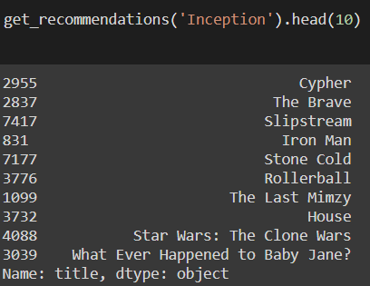
 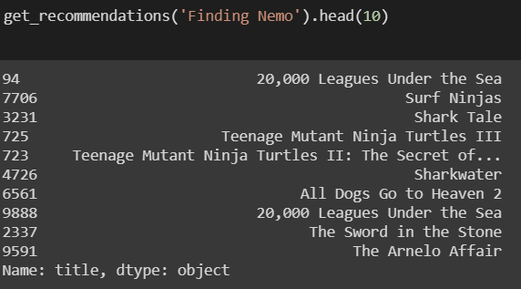
</p>
<!-- 


 -->
It’s quite obvious that these recommendations have been made solely based on the movie descriptions, without looking at extra information like the cast and crew, or popularity of the movie and other user’s ratings. 

To take content-based filtering to the next step, we look at the movie **metadata** - including the **cast, crew and keywords** about the movie. From the crew, we take only the director as our feature for now, however this will be extended in the future. There are several other departments to take into consideration like Writing, Director of Photography, Sound Design / Music, Screenplay, etc. and based on which is the most important to a user, we can weigh it accordingly. For the cast, we take the top three names from the credits list, as these correspond to the major characters. However, some users still watch movies regardless of the size of the role of their favorite actor, so this can also be considered in the weighting process. For example, the director has been weighted thrice as much as other cast members, so it is given more priority. 

Coming to the keywords, we do a basic frequency based filtering to remove those words that occur only once. This is followed by **stemming**, which refers to the process of reducing each word to its root, without its suffixes or prefixes ( called the lemma ). Eg. “run” and “running.” are considered the same word since they have the same meaning with respect to the plot.

Some examples of the recommendations after taking into account the metadata : 

<p align="center">
 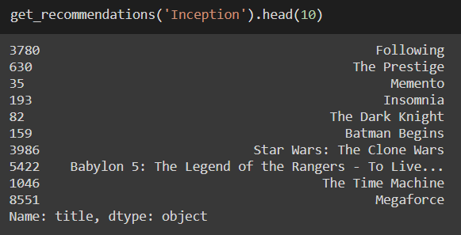
 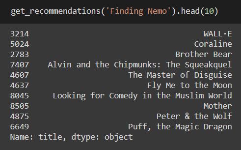
</p>

<!-- 
 -->

It does a much better job!
Some further experiments we can perform in the future including weighting based on crew, actors, genre, or other features like language. 


#### Collaborative Filtering 

The content-based filtering algorithm solely takes into consideration the movie information, and nothing about the personal taste of the user while giving suggestions. Hence, every user would be recommended the same set of movies, regardless of who they are and what they like. Hence, we bring in collaborative filtering, which suggests movies to a user based on what other users with similar preferences have enjoyed watching. We use a dataset of user ratings for this algorithm, which correspond to our movie database dataset. 

We use the **Surprise library**, which uses Singular Value Decomposition to compute accuracy measures like **Root Mean Square Error** and **Mean Absolute Error**, using a k-fold cross-validation procedure (in our case, 5-fold). 

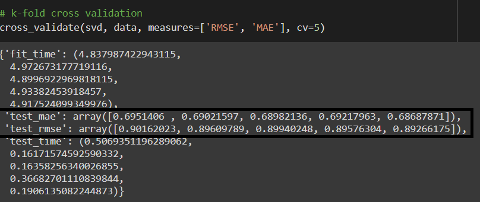

As we can see, we get an average Root Mean Square Error of about 0.896. We can then go ahead with the training and predictions. 

Here's an example of a user (with userId 1) and all the movies they have rated. It seems like this user is more inclined towards Thriller or Action based movies, and not so much inclined towards Comedy or Animation.

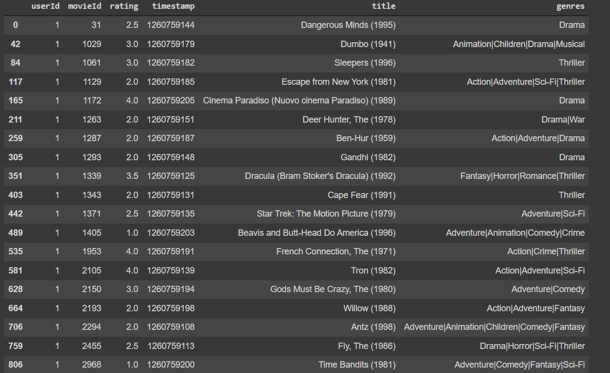

We run our algorithm to predict how this user would rate a new movie, and this is based on how other users with similar preferences have rated that movie. 

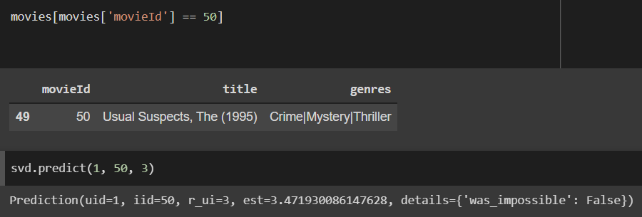
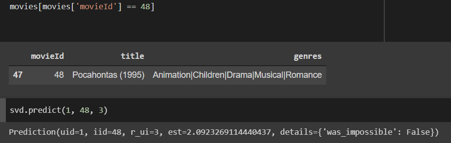

We can see that the user rating prediction for The Usual Suspects is a 3.47, while the prediction for Pocahontas is a 2.09. This is in line with the earlier observation, as The Usual Suspects is more of a Thriller and Mystery, while Pocahontas is more of an Animation and Musical.

Our next step, is to build a **hybrid** model that incorporates both the content-based and collaborative filtering techniques, to recommend movies taking into account both the movie data as well as the particular user information.

#### Apriori

**Apriori**, is an association rule mining algorithm often used in frequent item set mining. The most important application of this algorithm is Market Basket Analysis, helping customers in purchasing based on their shopping trends. The most recent usage of Apriori is recommendation systems and hence the reason for implementation.

<u>Training the model:</u>

**Support**

The model is used to calculate the probability and helps determine the likelihood of a user to watch movie M2 when he has already watched movie M1. This is computed by calculating support, confidence and lift for a variety of movie combinations. 

Support is calculated for M1 movie using the following formula:

<p align="center">Support(M1) = (# users watch lists containing M1) / (#user watch lists)</p>

So, support calculates, the percentage of users with movie M1 in their watch lists out of all the users

**Confidence**

The confidence value of a certain movie is the percentage of users who have watched both M1 and M2 out of users whose watch lists contain M1 and confidence is denoted as Confidence (M1 -> M2) and the formula is:

<p align="center">Confidence (M1 -> M2) = (# users watch lists with M1 and M2) / (# users with M1 in their watch lists)</p>

Essentially, confidence is the measure of the likelihood of users watching M2 if it is recommended to users who have already watched M1 (subset of the population)

**Lift**

The measure of the increase in likelihood of movie M2 being watched by users who watched M1 over its likelihood when recommended to the entire population. The higher the value of the lift, more likely it is for users to watch M2 when recommended to users with M1 in their watch lists. The formula is 

<p align="center">Lift ( M1 -> M2) = Confidence (M1 -> M2) / Support (M2)</p>

The antecedents are the movies watched and consequents are the suggested movies using Apriori:

<!--  -->
<p align="center">
 
</p>

### Optimization

A part of the optimization would include applying Dimensionality Reduction on our model elements, and tuning a lot of hyperparameters that would help us reduce errors, loss and increase other useful metrics like accuracy.

<u>Applying PCA on BERT embeddings</u>

We first transform the sentences of the ```overview``` feature into BERT embeddings. The dimension of the embeddings in our code comes out to be 768. We then run PCA on the obtained BERT embeddings to carry out dimensionality reduction. The resultant reduced dimension of the embeddings comes out to be 60. The explained variation per principal component is 0.897.

After running PCA on our BERT embeddings, we run a cosine similarity measure on the obtained matrix instead of the TF - IDF matrix that was used in the initial content based filtering approach. We observe improved results as can be seen from the figure below:

<p align="center">
 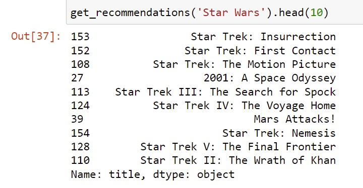
</p>

## Timeline
 
Since the project expects multiple stages and processes, the team members will collaborate on each section to ensure timely delivery of the module, reduced error probability, and a good learning experience. Our members will use tools and services like GitHub, LiveShare, etc. to ensure that they are actively working on ideation and implementation. Bigger sections will be broken into smaller phases and will be taken over by all the members in multiple chunks. The whole project timeline will consist of such phases, are detailed as below -

|                    **Process/Stage**                   | **Date Range** |
|:------------------------------------------------------:|:--------------:|
|         Data Collection, Cleaning & Preparation        |  10/05 - 10/25 |
|              Feature Creation & Selection              |  10/25 - 11/05 |
|                 Modelling (Unsupervised)               |  11/05 - 11/16 |
|                Modelling (Supervised)                  |  11/16 - 11/25 |
|            Optimization & Tuning Parameters            |  11/25 - 11/28 |
|           Implementing Final Modules & Models          |  11/28 - 12/01 |
|              Final Proposal & Presentation             |  12/01 - 12/07 |


## Potential Results and Discussions

By the end of our development and deployment cycle, we intend to build a high-accuracy Movie Recommender System that uses Content-based and Collaborative Filtering in tandem, using Supervised & Unsupervised Learning algorithms. 
 
We also plan on making use of a Python package called recmetrics[2] to evaluate & visualize all our results against a variety of metrics. Other suitable metrics include  Precision - top n, Recall - top n, Area under the Curve (AUC), Mean Average Precision (mAP), Intra-List Similarity, Coverage & Personalization.

## References

1. F. Maxwell Harper and Joseph A. Konstan. 2015. The MovieLens Datasets: History and Context. ACM Trans. Interact. Intell. Syst. 5, 4, Article 19 (January 2016), 19 pages. DOI:https://doi.org/10.1145/2827872
 
2. “Recmetrics.” PyPI, https://pypi.org/project/recmetrics/ 
 
3. Kumar, Manoj, et al. "A movie recommender system: Movrec." International Journal of Computer Applications 124.3 (2015).
 
4. Cintia Ganesha Putri, Debby, Jenq-Shiou Leu, and Pavel Seda. "Design of an unsupervised machine learning-based movie recommender system." Symmetry 12.2 (2020): 185.
 
5. Chen, Hung-Wei, et al. "Fully content-based movie recommender system with feature extraction using neural network." 2017 International Conference on Machine Learning and Cybernetics (ICMLC). Vol. 2. IEEE, 2017.
 
6. Cui, Bei-Bei. "Design and implementation of movie recommendation system based on Knn collaborative filtering algorithm." ITM web of conferences. Vol. 12. EDP Sciences, 2017.

7. Katarya, Rahul, and Om Prakash Verma. "An effective collaborative movie recommender system with cuckoo search." Egyptian Informatics Journal 18.2 (2017): 105-112.
